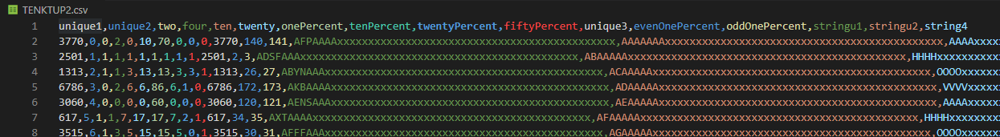

# Part 1

## Introduction

For the project, we will implement a schema and benchmark a relational database system. The system will then be put through a grinder. Testing how the system performs with datasets of various sizes. And testing how the system performs when we tweak its settings.

## System

The system we have chosen is MySQL.

MySQL has been around for 25+ years and has been crowned as the world's most popular DBMS. [source](https://community.idera.com/database-tools/blog/b/community_blog/posts/why-is-mysql-so-popular#:~:text=MySQL%20has%20emerged%20as%20the,such%20as%20MongoDB%20and%20PostgreSQL.)

So it would be an utmost priority for two CS students, near graduation, to gain intimate knowledge and experience with such a ubiquitous system.

To host the database, we went the cloud route. Additionally, using a virtual machine would grant us that sweet sweet extra credit. As a result, our database lives in Google Cloud Platform.

figure 1.

## Data Generation

To generate usable and scalable data, we followed the guidelines for the Wisconsin benchmark.

The guidelines call for a relation with 16 attributes. 3 0f which are strings and the rest integers. Of the integers, 2 are randomly-generated keys, and the rest are cyclically-generated numbers from specific ranges. Of the strings, stringu1 and stringu2 are randomly generated based on the first key. string4 is cyclically generated.

datagen.py can generate a specified number of tuples using the following format: python3 datagen.py (no_of_tuples).

figure 2. generating tuples

figure 3. ONEKTUP

figure 4. TENKTUP1

figure 5. TENKTUP2

## Demonstration

Here's a demonstration the data generation and insertion. mysqlinsert.py is used to insert the csv files.

figure 6. create/insert script

figure 7. changing parameters for each table

figure 8. tables loaded in

  

figure 9. 4/16 columns from ONEKTUP

## Lessons Learned

### Mike's String Struggle

In developing the data generation script, we had some issues creating the strings (by we I mean I -- Michael).

Earlier versions of the script used the string format of the early Wisconsin Benchmark. If I had read just a few more pages of the document, I would have realized the string format was updated in a later version of the Benchmark.

I ended up wracking my brain trying to figure out how to implement the algorithm to generate the string pattern. I spent too many hours staring at nested while loops. Losing track of several variables and perhaps 2% of my sanity (I'm being dramatic).

Luckily I met with Bruh the next day. He pointed out the updated string format - (7 letters [A-Z] followed by 45 x's) and generation pattern.

Long story short: read the whole document before you program!
