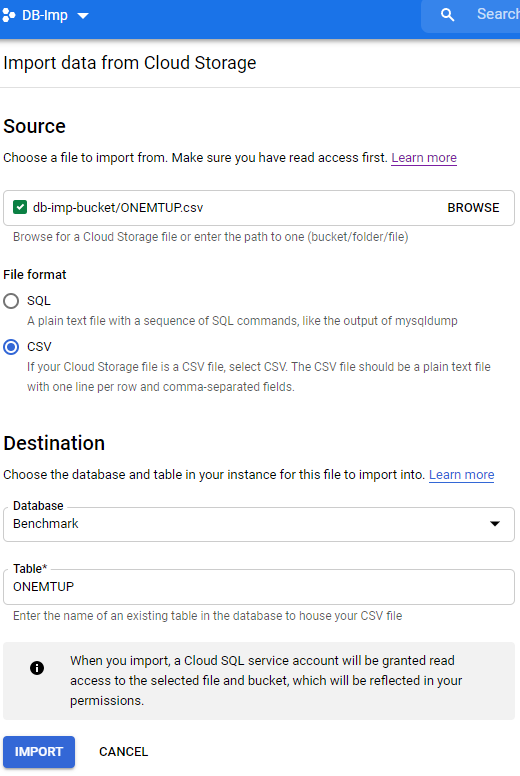

# Part II<!-- omit in toc -->

- [System Research](#system-research)
  - [1. Storage Engines](#1-storage-engines)
  - [2. Index Condition Pushdown](#2-index-condition-pushdown)
  - [3. Hash Join Buffer Size](#3-hash-join-buffer-size)
  - [4. Adaptive Hash Index](#4-adaptive-hash-index)
  - [5. Adaptive Hash Index - Partitions](#5-adaptive-hash-index---partitions)
- [Performance Experiment Design 1](#performance-experiment-design-1)
  - [Performance Issue Test](#performance-issue-test)
  - [Datasets](#datasets)
  - [Queries](#queries)
  - [Parameters Set/Varied](#parameters-setvaried)
  - [Results Expected](#results-expected)
- [Performance Experiment Design 2](#performance-experiment-design-2)
  - [Performance Issue Test](#performance-issue-test-1)
  - [Datasets](#datasets-1)
  - [Queries](#queries-1)
  - [Prameters Set/Varied](#prameters-setvaried)
  - [Results Expected](#results-expected-1)
- [Performance Experiment Design 3](#performance-experiment-design-3)
  - [Performance Issue Test](#performance-issue-test-2)
  - [Datasets](#datasets-2)
  - [Queries](#queries-2)
  - [Parameters Set/Varied](#parameters-setvaried-1)
  - [Results Expected](#results-expected-2)
- [Performance Experiment Design 4](#performance-experiment-design-4)
  - [Performance Issue Test](#performance-issue-test-3)
  - [Datasets](#datasets-3)
  - [Queries](#queries-3)
  - [Parameters Set/Varied](#parameters-setvaried-2)
  - [Results Expected](#results-expected-3)
- [Lessons Learned/Issues Encountered](#lessons-learnedissues-encountered)

## System Research

### 1. Storage Engines

According to the official docs, "the choice of a transactional storage engine such as InnoDB or a nontransactional one such as MyISAM can be very important for performance and scalability." By default, the storage engine for new tables is InnoDB. It claims that InnoDB tables "outperform the simpler MyISAM tables, especially for a busy database." MyISAM has a small footprint and does table-level locking which reduces performances (relative to InnoDB) so "it is often used in read-only or read-mostly workloads in Web and data warehousing configurations." InnoDB tables arrange data using primary key. Each table's primary key is used to create a clustered index so that I/O is reduced when when accessing data sequentially. InnoDB tables also use "Adaptive Hash Indexing" to make lookups of frequently accessed rows faster (which we will benchmark as well). The documentation also states you can create and drop indexes and perform other DDL operations with much less impact on performance and availability." InnoDB tables were "designed for CPU efficiency and maximum performance when processing large data volumes".

Truncated Table 16.1 from MySQL docs: Storage Engines Features
| Feature | MyISAM | InnoDB |
| :--- | :---: | :---: |
| B-tree indexes | Yes | Yes |
| Clustered indexes | No | Yes |
| Data caches | No | Yes |
| Foreign key support | No | Yes |
| Hash indexes | No | No |
| Index caches | Yes | Yes |
| Locking granularity | Table | Row |
| Storage limits | 256TB | 64TB |
| Transactions | No | Yes |

### 2. Index Condition Pushdown

The most frequently used storage engine is InnoDB - when a primary-key is specified, rows are inserted ordered according to the primary-key and a clustered index is created so that entire rows can be read in quickly. _Index Condition Pushdown_ (ICP) is an optimization setting that can be toggled when a secondary index is created. If it is off, "the storage engine traverses the (secondary) index to locate rows" and "returns them to the MySQL server which evaluates the WHERE condition for the rows." If enabled, and the WHERE condition in the query only needs the secondary indexed column, then it can push it to the storage engine which evaluates the condition using the index entry "and only if this is satisfied is the row read from the table." This is supposed to make queries that use the secondary indexed column along with other columns to be retrieved more performant.

### 3. Hash Join Buffer Size

In our one-on-one meeting with Dr. Tufte, she had mentioned MySQL isn't as advanced as Postgres and this is evident in the algorithms for joins - "Beginning with MySQL 8.0.20, support for block nested loop is removed, and the server employs a hash join wherever a block nested loop would have been used previously." A hash join is used for joins using at least one equi-join condition and is supposed to be faster than block nested loops. Previous versions could have it toggeled on/off but the current version defaults to using hash joins and can't be turned off. What we can vary is the memory used by hash joins. It is set by the 'join_buffer_size' system variable - such that it can't use more than this amount. If the memory needed for the join is greater, it is handled by spilling over to files on disk (we might run into a "too many open files" error so we may also have to set 'open_files_limit' higher). The docs add that if the buffer size is set higher than needed for a query - it will allocate the amount that it actually will need.

### 4. Adaptive Hash Index

The Adaptive Hash Index is a MySQL feature. It allows InnoDB to perform more like an in-memory database. According to the MySQL documentation, the adaptive hash index does not sacrifice transactional features or reliability.

With the Adaptive Hash Index turned on, InnoDB will monitor queries. If a query could use a boost from creating a hash index, InnoDB will hash automatically.

Leaving Adaptive Hash Indexing on may increase performance performance. However Adaptive Hash Indexing has some drawbacks.

The overhead to monitor queries may outweigh any potential gains. This may become noticeable when using multiple concurrent joins. Queries using LIKE and % will may not benefit as well.

Using the Adaptive Hash Index feature can either significantly improve a system's performance or reduce performance with unnecessary overhead.

### 5. Adaptive Hash Index - Partitions

By default, the Adaptive Hash Index feature has 8 partitions. The partitions be increased to a maximum of 512. This setting is done by modifying the value of the `innodb_adaptive_hash_index_parts` variable.

Having many partitions benefit systems that have many concurrent processes going on. Additionally, given the same situation, there may be a benefit in disabling the Adaptive Hash Index completely.

## Performance Experiment Design 1

### Performance Issue Test

Comparing read and write performance of two storage engines - InnoDB and MyISAM.

### Datasets

We'll use ONEMTUP and execute 'read-only' and 'write-only' queries using parallel connections that simulates 4 concurrent users.

- User 1: read then write
- User 2: write then read
- User 3: read then write
- User 4: write then read

### Queries

Four concurrent read/write processes using 10% selection with no index:

```
SELECT count(*) FROM ONEMTUP
WHERE tenPercent = 0

UPDATE ONEMTUP
SET string4 = 'x' where tenPercent = 0
```

Get `query_id` from `SHOW PROFILES;`  
Get query time from `SHOW PROFILE FOR QUERY <id>`

### Parameters Set/Varied

Enable profiling to see execution time: `SET profiling = 1;`  
Disable `AUTOCOMMIT`  
The command `SHOW ENGINES` tells us that the default engine is InnoDB, so to use other engines - we must specify explicitly. We'll create two tables: `CREATE TABLE ... ENGINE=InnoDB` and `CREATE TABLE ... ENGINE=MYISAM`  
To verify:

```
SELECT table_name, table_type, engine
FROM information_schema.tables
WHERE table_schema = 'database_name'
ORDER BY table_name;
```

### Results Expected

InnoDB seems to have many of the features we learned about or used in Postgres. In InnoDB, clustered indexes are implemented when specifying the primary-key whereas MyISAM only has unclustered indexes. Having it means the data is stored in primary-key sorted order which would decrease I/O when rows are processed sequentially. Although, in these tests, the biggest difference would be the result of InnoDB's row-level locking vs. MyISAM's table-level locking. InnoDB should perform magnitudes better than MyISAM.

## Performance Experiment Design 2

### Performance Issue Test

Comparing Index Condition Pushdown enabled/disabled in an InnoDB table with a secondary index. A `WHERE` condition that uses the secondary index, and a second `WHERE` condition that can't use the index by itself. The 'adaptive hash index' must be disabled so it doesn't cache the tuple (since we will run the query multiple times).

### Datasets

TENMTUP with its original primary-key and a clustered index on the `stringu1` column.

### Queries

`CREATE INDEX design2_index ON TENMTUP(unique1, stringu1)`
To verify index: `SHOW INDEXES FROM TENMTUP;`

```
SELECT count(*) FROM TENMTUP
WHERE fiftyPercent = 0
AND stringu1 like '%SHDA%'
AND string4 like 'OOOO%';
```

Get `query_id` from `SHOW PROFILES;`  
Get query time from `SHOW PROFILE FOR QUERY <id>`

### Parameters Set/Varied

Disable `innodb_adaptive_hash_index`  
Enable profiling to see execution time: `SET profiling = 1;`  
Disable `AUTOCOMMIT`

Disabled run: `SET optimizer_switch = 'index_condition_pushdown=off';`  
Enabled run: `SET optimizer_switch = 'index_condition_pushdown=on';`

### Results Expected

When enabled, the query will get a `stringu1 like '%SHDA%'` tuple from the index - for each, read the full row, then check the `string4 like 'OOOO%` condition, then return those rows.
When disabled, the query will use the secondary index to find `stringu1 like '%SHDA%'` and retreive full rows back to the server, then filter through them to find `string4 like 'OOOO%'`
Reading only 1 column instead of 16 should mean the enabled option performs better.

## Performance Experiment Design 3

### Performance Issue Test

Increase/decrease the `join_buffer_size` (our working memory for joins). The default value `join_buffer_size` is 262144. (I think that mean 262144 / 8 = 32768 bytes = 32MB)

### Datasets

Two identical tables with one million tuples each: `TENMTUP` and `TENMTUPTOO`

### Queries

An equi-join condition using the `ten` column from each table:

```
EXPLAIN SELECT count(*) FROM TENMTUP
JOIN TENMTUPTOO ON (TENMTUP.ten = TENMTUPTOO.ten);
```

... should tell us it is using hash join.

```
SELECT count(*) FROM TENMTUP
JOIN TENMTUPTOO ON (TENMTUP.ten = TENMTUPTOO.ten);
```

### Parameters Set/Varied

In GCP, edit the configuration flags: `join_buffer_size` = 1024 (1 KB)  
In GCP, edit the configuration flags: `join_buffer_size` = 524288 (64 MB)  
In GCP, edit the configuration flags: `join_buffer_size` = 8388608 (1 GB)

### Results Expected

Setting the size too small will increase execution time because it will overflow into the disk where I/O is much more time consuming. Setting it too high should have no affects since the query will eventually only allocate the amount that it needs since the query will eventually only allocate the amount that it needs.

## Performance Experiment Design 4

### Performance Issue Test

Observing the performance of the Adaptive Hash Index

### Datasets

TENMTUP
1MTUP
1MTUP

### Queries

(Joining 2 Tables)

```
SELECT count(*)
FROM TENMTUP A, TENMTUP B
WHERE A.twenty = B.ten
```

(Joining 3 Tables)

```
SELECT count(*)
FROM TENMTUP A, 1MTUP B, 1MTUP C
WHERE (A.twenty = B.ten) AND (C.twenty = B.ten)
```

(Query that uses a range)

```
SELECT count(*)
FROM TENMTUP T
WHERE  T.twenty < 15
```

### Parameters Set/Varied

Adaptive Hash Indexing is modified via the variable `innodb_adaptive_hash_index`

Setting the variable to `on` enables Adaptive Hash Indexing
Setting the variable to `off` disables Adaptive Hash Indexing

### Results Expected

Query 1

The system should performance better with adaptive hash indexing turned on. Turned off, the system should perform slower. It is a single join that should fit in memory.

The query benefits from memory speed and hash speed.

Query 2

The system should perform slower with adaptive hash indexing turned on. Joining three tables increases the size of the data. This should provide enough workload to see a decrease in performance speed.

Query 3

The system should perform slower with adaptive hash indexing turned on. Hash Indexing does not work well when using a range operator such as `<`.

## Lessons Learned/Issues Encountered

- The performance_schema engine and table would given a lot more information about execution time but only for systems N1 with 8 or more processors or with very high memory on GCP. We can't afford it. Instead, we have to use the deprecated 'show profiles' which has similar information.
- Profiling is set to 'off' with each new connection, so we have to turn it on every time we start a session.
- We should turn off autocommit to avoid unnecessary I/O when issuing large numbers of consecutive INSERT, UPDATE, or DELETE statements. We got some transaction semantics practice and saw how commiting should be grouped otherwise queries in loops take longer.
- While trying to insert a one-million row table, our script would time-out. We changed various timeout settings and packet sizes in GCP but still had problems, so we used GCP's import CSV from a bucket option.  
  
- Oracle purchased MySQL from Sun Microsystems and some poeple including the creators don't like that Oracle's governing body for Oracle and MySQL are the same - because it creates a conflict of interest. Like, they would make decisions in favor of thier higher priced db - oracle. Therefore, the creator spun off MySQL and created MariaDB. MariaDB is more open-sourced and easier to license than MySQL.
